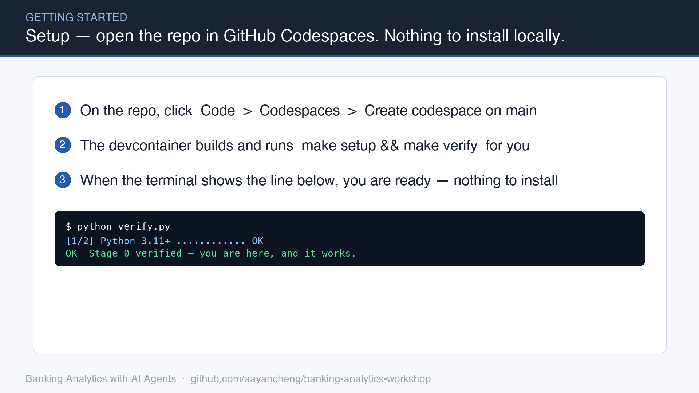
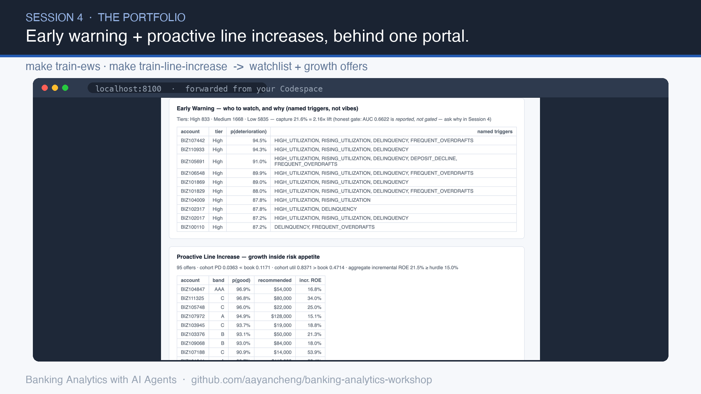

# Banking Analytics with AI Agents — Workshop Repo

**The promise: at any moment, one command tells you where you are — and that it works.**

```bash
python verify.py
```

This repository is the lab spine for a 5-session workshop that rebuilds a small-business
lending analytics platform — synthetic data, a credit scorecard, and decision apps — the
same way a real one was built with AI agents in four days. Every session ends at a tagged,
verified checkpoint. If you get lost, you are never more than one command from a working state.

## What you'll build

Every analytics decision is the same four moves — **build the portfolio, score the risk,
decide & price, monitor & step in.** You'll learn them on small-business lending, then reuse
the very same moves for investing, marketing, fraud, and beyond.



By Session 4 the shared score-spine and its decision apps run behind one portal — early
warning and proactive line increases over the same borrowers, each decision explained:



## Quick start

**Guaranteed path (browser, nothing to install):** open this repo in GitHub Codespaces.
When the container finishes building, `verify.py` has already run. Green means go.

**Fast path (your laptop):** Python 3.11+ required.

```bash
git clone https://github.com/aayancheng/banking-analytics-workshop.git && cd banking-analytics-workshop
make setup     # creates .venv and installs pinned dependencies
make verify    # tells you where you are, and that it works
```

## The stages

One repo, linear history, one tag per session. Every stage is self-sufficient: it commits
the *outputs* of the stage before it, so missing a session costs you nothing at the next one.

| Tag | You are at the end of | Contains |
|---|---|---|
| `stage-0` | pre-work | environment only: pinned deps, devcontainer, `verify.py` |
| `stage-1` | Session 1 | synthetic SME portfolio data, the generator, a data-quality report |
| `stage-2` | Session 2 | scorecard trained + evaluated, hard metric gate |
| `stage-3` | Session 3 | adjudication + pricing apps running on the score |
| `stage-4` | Session 4 | early warning + line management + portal |
| `stage-5` | Session 5 | model documentation pack, demo-ready platform |

**Lost?** `git stash && git checkout stage-N && python verify.py` — or open the tag in
Codespaces. You are back at a verified checkpoint.

## Workshop materials

Decks, dual-track lab sheets, and agent-track prompt cards live in [workshop/](workshop/) —
one clone carries everything a student needs.

## Two tracks, one checkpoint

Each lab can be done by **directing an AI agent** (prompt cards provided) or by **running
the provided scripts by hand**. `verify.py` does not know or care which track you took —
the checkpoint is the same. No paid AI subscription is ever required to complete this workshop.

## Data

All data is 100% synthetic, generated by a deterministic, seeded process you will study in
Session 1 (`shared/data_generator.py`). No real customer data exists anywhere in this repo.
Identical seeds mean your numbers match the slides exactly — and *why identical numbers
would alarm you in production* is itself Session 1 material.

## Commands

| Command | Does |
|---|---|
| `make setup` | create `.venv`, install pinned dependencies |
| `make verify` | run `verify.py` for the current stage |
| `make data` | regenerate the synthetic data + data-quality report (Session 1 lab) |
| `make run` / `make stop` | start / stop the apps (from stage-3 on) |

## License

MIT — see [LICENSE](LICENSE). Built by [TeamYan](https://teamyan.substack.com) from the
open [BusinessBankingApp](https://github.com/aayancheng/BusinessBankingApp) reference build.
