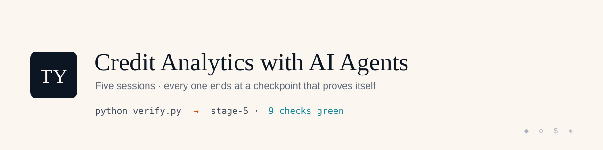

# Credit Analytics with AI Agents

**The promise: at any moment, one command tells you where you are — and that it works.**

```bash
python verify.py
```

This repository is the lab spine for a 5-session workshop that rebuilds a small-business
lending analytics platform — synthetic data, a credit scorecard, and decision apps — the
same way a real one was built with AI agents in four days. Every session ends at a tagged,
verified checkpoint. If you get lost, you are never more than one command from a working state.

## What you'll build

Every analytics decision is the same four moves — **build the portfolio, score the risk,
decide & price, monitor & step in.** You'll learn them on small-business lending, then reuse
the very same moves for investing, marketing, fraud, and beyond.


By Session 4 the shared score-spine feeds a portfolio you can act on — a ranked early-warning
watchlist that names *why* each borrower is deteriorating, not just that it is:


## Quick start

**Guaranteed path (browser, nothing to install):** launch this repo in GitHub Codespaces —
one click, no local setup. When the container finishes building, `verify.py` has already run.
Green means go.

[](https://codespaces.new/aayancheng/banking-analytics-workshop?quickstart=1)

**Fast path (your laptop):** Python 3.11+ required.

```bash
git clone https://github.com/aayancheng/banking-analytics-workshop.git && cd banking-analytics-workshop
make setup     # creates .venv and installs pinned dependencies
make verify    # tells you where you are, and that it works
```

## The stages

One repo, linear history, one tag per session. Every stage is self-sufficient: it commits
the *outputs* of the stage before it, so missing a session costs you nothing at the next one.

| Tag | You are at the end of | Contains |
|---|---|---|
| `stage-0` | pre-work | environment only: pinned deps, devcontainer, `verify.py` |
| `stage-1` | Session 1 | synthetic SME portfolio data, the generator, a data-quality report |
| `stage-2` | Session 2 | scorecard trained + evaluated, hard metric gate |
| `stage-3` | Session 3 | adjudication + pricing apps running on the score |
| `stage-4` | Session 4 | early warning + line management + portal |
| `stage-5` | Session 5 | model documentation pack, demo-ready platform |

**Lost?** `git stash && git checkout stage-N && python verify.py` — or open the tag in
Codespaces. You are back at a verified checkpoint.
See [workshop/CHECKPOINTS.md](workshop/CHECKPOINTS.md) for how to move between stages, keep
your own work on a branch, and combine your work with a stage.

## Workshop materials

Decks, dual-track lab sheets, and agent-track prompt cards live in [workshop/](workshop/) —
one clone carries everything a student needs.

## Two tracks, one checkpoint

Every lab can be done two ways. **Pick per session** — you can switch any week, and
`verify.py` cannot tell which one you chose.

| | 🤖 **Agent track** | ⌨️ **Manual track** |
|---|---|---|
| What you do | Brief an AI coding agent, then **review its work** | Run the provided commands yourself |
| What you need | An AI agent that can run shell + Python **inside this repo** | Nothing beyond this repo |
| Skill being trained | Directing and **grading** an agent under quality gates | The mechanics of the pipeline itself |
| Cost | Whatever your agent costs (free tiers are fine) | **Free** |

> **No paid AI subscription is ever required.** The manual track reaches the identical
> checkpoint every single week, and it is not a lesser path — some sessions are worth doing
> by hand precisely because you feel every step.

### What each track looks like — Session 1 as the example

**🤖 Agent track**

1. Open the prompt card [`workshop/prompt-cards/AC-1.md`](workshop/prompt-cards/AC-1.md)
2. Fill in its two blanks — your name, and **one extra audit question of your own**
3. Give the brief to your agent and let it generate and audit the portfolio
4. **Review its output against the checklist.** Find at least one thing it did not check, and
   send it back to check that
5. Run `python verify.py` **yourself** — the checkpoint is never delegated

**⌨️ Manual track**

1. `make data` — regenerate the portfolio yourself
2. Confirm your console numbers match the lab sheet exactly (seed 42, so they will)
3. Work through the same audit checklist against `reports/data_quality.md`
4. Run `python verify.py`

Same checkpoint, same tag, same credit.

> **On the agent track, the reviewing *is* the lesson — not the typing.** Every prompt card
> ends with a review checklist, and that checklist is the real skill: knowing what a lazy agent
> would quietly skip, and sending it back.

### Which AI tools work for the agent track?

Anything that can **read this repo and run shell commands and Python in it** — for example
Claude Code, GitHub Copilot (agent mode or CLI), Codex CLI, or Cursor.

⚠️ A **chat-only** tool — a browser tab with no access to your files — is not enough. You would
be copying code back and forth by hand, which is the slowest of both worlds. If that is all you
have available, take the manual track; it is the better experience.

## Data

All data is 100% synthetic, generated by a deterministic, seeded process you will study in
Session 1 (`shared/data_generator.py`). No real customer data exists anywhere in this repo.
Identical seeds mean your numbers match the slides exactly — and *why identical numbers
would alarm you in production* is itself Session 1 material.

## Commands

| Command | Does |
|---|---|
| `make setup` | create `.venv`, install pinned dependencies |
| `make verify` | run `verify.py` for the current stage |
| `make data` | regenerate the synthetic data + data-quality report (Session 1 lab) |
| `make run` / `make stop` | start / stop the apps (from stage-3 on) |

## License

MIT — see [LICENSE](LICENSE). Built by [TeamYan](https://teamyan.substack.com) from the
open [BusinessBankingApp](https://github.com/aayancheng/BusinessBankingApp) reference build.
