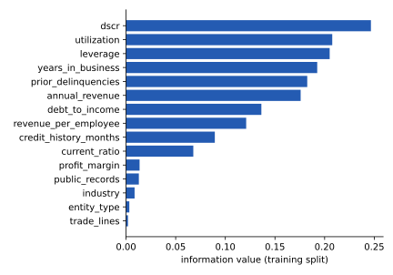

## Method: weight of evidence plus logistic regression

The scorecard is built in three steps, all with the `optbinning` package
(`score/src/train.py`):

1. **Binning.** Each feature is split into bins by optimal binning (`BinningProcess`),
   fitted on the training split only.
2. **Weight of evidence.** Each value is replaced by its bin's weight of evidence (WoE):
   the log of the bin's share of non-defaulters over its share of defaulters, so a
   safer bin has a higher WoE ([glossary](../../reference/glossary.qmd)).
3. **Logistic regression and scaling.** A logistic regression on the
    WoE columns gives the PD; its log-odds are converted to
   points and then mapped onto `SCORE_MIN`–`SCORE_MAX` ([4.1](purpose.qmd#the-output)).

```python
binning_process = BinningProcess(                         # score/src/train.py
    variable_names=FEATURE_COLUMNS,
    categorical_variables=CATEGORICAL,
)
estimator = LogisticRegression(solver="lbfgs", max_iter=1000)
scorecard = Scorecard(
    binning_process=binning_process,
    estimator=estimator,
    scaling_method="pdo_odds",
    scaling_method_params={"pdo": 50, "odds": 20, "scorecard_points": 600},
    reverse_scorecard=False,  # False gives FICO-like direction: high score = low default risk
)
scorecard.fit(X_train, y_train)
```

`pdo_odds` is the conventional points-to-double-the-odds scaling. It changes the points,
not the ranking or the PD: the AUC and every calibration figure in [4.5](performance.qmd)
are computed from `predict_proba`, before any scaling.



### Why this method

A scorecard is the simplest model a validator can replicate by hand. Every point of a
score traces to one bin of one feature, and the model's log-odds are an intercept plus a
sum of WoE × coefficient terms, one per feature. That makes the **reason codes exact**:
`feature_contributions` (`score/src/reason_codes.py`) returns each feature's term, and the
adverse reasons for an applicant are the largest positive ones. Nothing is approximated
and no attribution method sits between the model and the explanation.



## Alternative considered: a gradient-boosted model

The platform already contains a gradient-boosted (LightGBM) model trained on the same
applicants: the adjudication model, D5. It is not a clean challenger, because it is
*richer* than the scorecard — its  inputs include the score and
PD themselves — but that makes it a demanding benchmark. On the same held-out applicants
([4.2](data.qmd#split-and-seed)):

| Model | Held-out AUC, same held-out applicants |
|---|---|
| Business Credit Score (this chapter) |  |
| Adjudication, LightGBM |  |

The two are comparable: the gap between them is smaller than the half-width of the
scorecard's own bootstrap interval, ±
([4.5](performance.qmd#discrimination)). The
gradient-boosted model buys no discrimination here, and it costs the exact reason codes:
its explanations come from SHAP values (`adjudication/src/reason_codes.py`), an
attribution method a validator would then have to validate as well. For the model every
other component consumes, the scorecard is kept.

## Feature selection and signal

The  features are a fixed list, set when the scorecard was
built (`FEATURE_COLUMNS`, [4.2](data.qmd#features)), not the output of an automated search. Their information value
(IV) on the training split, beside each feature's share of the variance of the model's
logit on the held-out applicants:



{#fig-iv}

@fig-iv shows the ranking. Of the ,
 fall below the conventional 
line for a predictive feature. They are not
all alike:

- `industry`, `entity_type` and `trade_lines` have **no role at all** in how the data
  generator draws default: they are structural zeros ([glossary](../../reference/glossary.qmd)).
  Their low IV is correct, and their presence in the model is finding 3
  ([4.7](limitations.qmd)).
- `public_records` and `profit_margin` **do** enter the generator's default logit
  (`shared/data_generator.py`). Their IV is low for reasons of shape, not of relevance:
  `public_records` is a rare 0/1 flag, and `profit_margin` has a small spread. Low IV is
  not evidence of no effect.

The last column is the better guide to what drives the score. IV measures one feature
alone; a coefficient's size depends on its feature's spread. The share of the logit's
variance each feature carries, from `feature_contributions`, is what the fitted model
actually uses.

### Coefficient signs

All  WoE coefficients share one sign,
****; coefficients with the opposite sign:
****. Because a higher WoE
means a safer bin, a negative coefficient means each feature moves the PD in the direction
its own bins say it should. No feature's effect has been reversed by its correlation with
the others, which is the usual symptom of collinearity in a scorecard
([4.4](assumptions.qmd#feature-independence)).



## Implementation note: the binning solver

`optbinning` fits each feature's bins with a constraint-programming solver (`"cp"`, via
OR-Tools) by default, and the committed scorecard uses that default. With the pinned
`ortools`, the CP solver crashes (`TypeError` inside `optbinning/binning/cp.py`) on some
columns — `requested_amount` on the training rows — and on some row subsets. The
 committed features bin cleanly under CP on the full training
split, so `train.py` is unaffected. Any refit that picks other raw columns or other rows
must pass the mixed-integer solver instead, as the three raw-column refits in
[4.6](sensitivity.qmd) do (`wiki/facts/score_stress.py`):

```python
extra = {"binning_fit_params": {c: {"solver": "mip"} for c in cols}} if mip else {}
```
