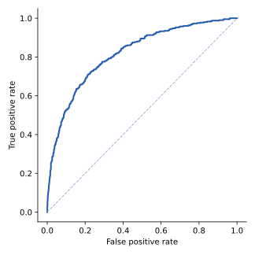
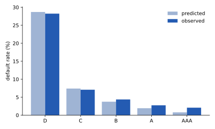
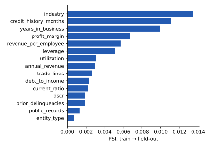

Every figure on this page names the population it was measured on. Unless stated
otherwise, that is the held-out  of applicants:
 rows the scorecard never saw while it was fitted
([4.2](data.qmd#split-and-seed)).

## Discrimination

| Measure | Held-out applicants |
|---|---|
| AUC |  |
| AUC, bootstrap 95% interval |  –  |
| KS |  |
| Gate ([4.9](gate.qmd)) | AUC ≥  — met |

The interval comes from  bootstrap resamples of the held-out
rows, drawn with the platform seed (`wiki/facts/score_facts.py`): the AUC is recomputed on
each resample and the interval is the central 95% of those values. Its half-width,
±, is the honest precision of any AUC quoted for this model
on this sample: a difference smaller than that is not evidence of anything.

{#fig-roc}

@fig-roc is the ROC curve behind the AUC. KS is the largest vertical gap between the
cumulative score distributions of defaulters and non-defaulters (`ks_statistic` in
`score/src/train.py`); it is reported, not gated.



### By population

The same model on the held-out applicants the bank actually books scores an AUC of
 ( rows), and
 on the  it rejects. The
full table is in [4.2](data.qmd#two-populations). The gate is met on all applicants; on the
booked the AUC is below the gate value. That is finding 2 ([4.7](limitations.qmd)).

## Rank-ordering and calibration by band



{#fig-calibration}

**Rank-ordering holds.** The observed default rate falls in every step from band D
() to band AAA ().

**Calibration is good where the defaults are, and loose where they are few.** The last
column divides the observed default rate by the mean predicted PD: 1 means the PD is right
on average in that band, above 1 means the model under-predicts. @fig-calibration shows the
two rates side by side.

- In bands D, C and B the ratio is ,
   and : inside the monitoring
  tolerance of  to 
  ([4.8](monitoring.qmd)).
- In bands A and AAA it is  and
  : outside that tolerance, with the model predicting
  fewer defaults than occur. These ratios rest on very few defaults —
   of  applicants in band A and
   of  in band AAA — so a
  handful of defaults either way moves them a long way. They are recorded as an
  observation in [4.7](limitations.qmd#observations), not a finding.

Band D holds  of the  held-out applicants
(): finding 4 ([4.7](limitations.qmd)).

## Stability

Population stability index (PSI) from the training split to the held-out split, computed
over the scorecard's own bins for each feature and over the five bands for the score:

| Measure | Train → held-out |
|---|---|
| Score PSI, by band |  |
| Largest feature PSI |  () |
| Features above the  watch level |  |

{#fig-psi}

@fig-psi shows every feature far below the watch level. That is expected, and it says
little: the two splits are a random partition of one cross-section, so their PSI measures
sampling noise, not change over time. Stability over time is untested — finding 1
([4.7](limitations.qmd)).

## Benchmark

The adjudication model (D5), a gradient-boosted model whose inputs include this score,
split with the same seed and stratification and so held out on the same applicants:

| Model | Held-out AUC, same held-out applicants |
|---|---|
| Business Credit Score |  |
| Adjudication, LightGBM |  |

Comparable discrimination: the gap is smaller than the scorecard's interval half-width.
Why the scorecard is kept is in [4.3](methodology.qmd#alternative-considered-a-gradient-boosted-model).

## The ceiling

Because the data are generated, the best AUC any model could reach can be computed: rank
applicants by the generator's own default logit without its noise term
(`wiki/facts/ceiling.py`, the only code in this documentation that reads the generator's
truth; it grades the data, not a model).



**Compare only within a row's sample.** The first two rows are measured over all
 applicants, the next two over the held-out split. Setting
the population ceiling () beside the scorecard's held-out
 makes the model look almost exactly at the maximum; they are
two different samples. On the held-out split itself the ceiling is
, and the scorecard falls short of it by
.

That gap is inside the ± interval above. The honest claim is
that the scorecard is **indistinguishable from the maximum** this data allows. The true
PD's higher AUC () is not reachable: it includes the
generator's unobserved noise term, which no model built on the observed features can know.
